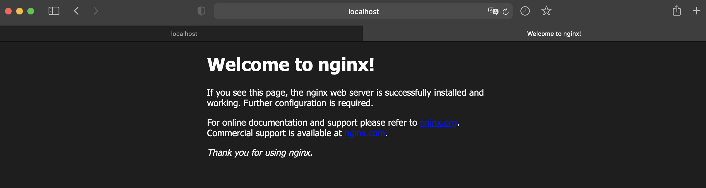
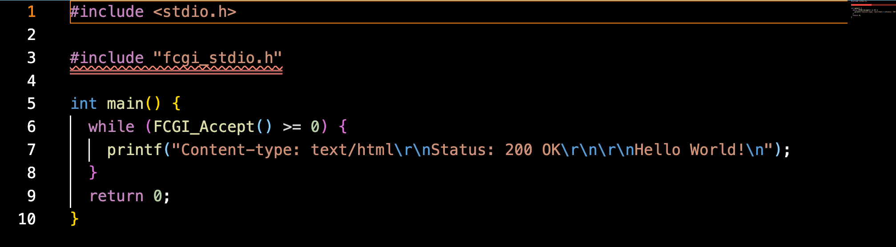
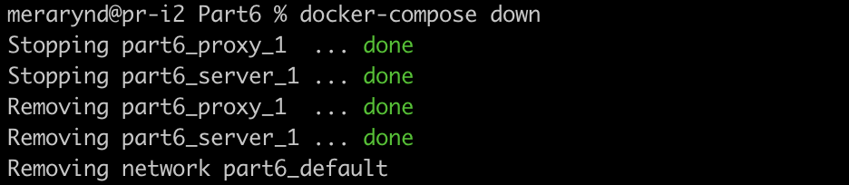

# Simple Docker

## Part 1. Готовый докер

##### Взять официальный докер образ с **nginx** и выкачать его при помощи `docker pull`


##### Проверить наличие докер образа через `docker images`


##### Запустить докер образ через `docker run -d [image_id|repository]`
##### Проверить, что образ запустился через `docker ps`


##### Посмотреть информацию о контейнере через `docker inspect [container_id|container_name]`


Где " nervouse_curran " - container_name.

##### По выводу команды определить и поместить в отчёт размер контейнера, список замапленных портов и ip контейнера


##### Остановить докер образ через `docker stop [container_id|container_name]`
##### Проверить, что образ остановился через `docker ps`


##### Запустить докер с портами 80 и 443 в контейнере, замапленными на такие же порты на локальной машине, через команду *run*


##### Проверить, что в браузере по адресу *localhost:80* доступна стартовая страница **nginx**


##### Перезапустить докер контейнер через `docker restart [container_id|container_name]`


##### Проверить любым способом, что контейнер запустился



## Part 2. Операции с контейнером

##### Прочитать конфигурационный файл *nginx.conf* внутри докер контейнера через команду *exec*


##### Создать на локальной машине файл *nginx.conf*
##### Настроить в нем по пути */status* отдачу страницы статуса сервера **nginx**


##### Скопировать созданный файл *nginx.conf* внутрь докер образа через команду 
`docker cp nginx.conf [container_id|:/etc/nginx/`
##### Перезапустить **nginx** внутри докер образа через команду
`exec [container_id| nginx -s reload`


##### Проверить, что по адресу *localhost:80/status* отдается страничка со статусом сервера **nginx**


##### Экспортировать контейнер в файл *container.tar* через команду 
`docker export [container_id| > container.tar`


##### Остановить контейнер

`docker stop [container_id|`


##### Удалить образ через `docker rmi [image_id|repository]`, не удаляя перед этим контейнеры


##### Удалить остановленный контейнер

`docker rm [container_id|`


##### Импортировать контейнер обратно через команду 
`docker import -c 'cmd["nginx", "-g", "daemon off;"]' container.tar nginx_merarynd`


##### Запустить импортированный контейнер

`docker run -dp 80:80 -p 443:443 [container_id|`


##### Проверить, что по адресу *localhost:80/status* отдается страничка со статусом сервера **nginx**


## Part 3. Мини веб-сервер

##### Написать мини сервер на **C** и **FastCgi**, который будет возвращать простейшую страничку с надписью `Hello World!`



##### Написать свой *nginx.conf*, который будет проксировать все запросы с 81 порта на *127.0.0.1:8080*


##### Запустить написанный мини сервер через *spawn-fcgi* на порту 8080

Нам потребуются команды :
```
docker pull nginx
docker run -d -p 81:81 --name name nginx
docker cp nginx.conf name:/etc/nginx/
docker cp server.c name:/home
docker exec -it name bash
apt-get update
apt-get install -y gcc spawn-fcgi libfcgi-dev
gcc -o server server.c -lfcgi
spawn-fcgi -p 8080 ./server
docker exec name nginx -s reload
```

##### Проверить, что в браузере по *localhost:81* отдается написанная вами страничка


## Part 4. Свой докер

#### Написать свой докер образ, который:


##### Собрать написанный докер образ через `docker build` при этом указав имя и тег
##### Запустить собранный докер образ с маппингом 81 порта на 80 на локальной машине и маппингом папки *./nginx* внутрь контейнера по адресу, где лежат конфигурационные файлы **nginx**'а.


##### Проверить через `docker images`, что все собралось корректно


##### Проверить, что по localhost:80 доступна страничка написанного мини сервера


##### Проверить, что теперь по *localhost:80/status* отдается страничка со статусом **nginx**


## Part 5. **Dockle**

##### Просканировать образ из предыдущего задания через `dockle [image_id|repository]`


##### Исправить образ так, чтобы при проверке через **dockle** не было ошибок и предупреждений


## Part 6. Базовый **Docker Compose**

##### Написать файл *docker-compose.yml*, с помощью которого:
##### 1) Поднять докер контейнер
##### 2) Поднять докер контейнер с **nginx**, который будет проксировать все запросы с 8080 порта на 81 порт первого контейнера
##### Замапить 8080 порт второго контейнера на 80 порт локальной машины


##### Остановить все запущенные контейнеры



##### Собрать и запустить проект с помощью команд `docker-compose build` и `docker-compose up`


##### Проверить, что в браузере по *localhost:80* отдается написанная вами страничка, как и ранее


